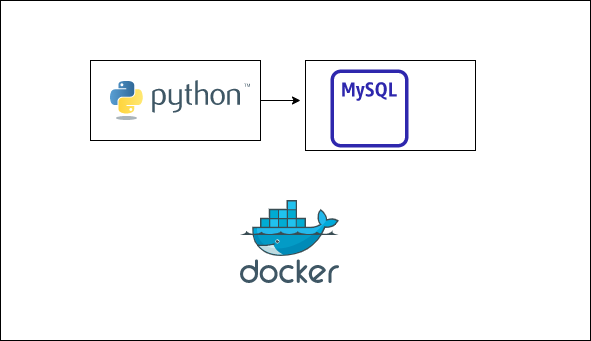

# DockerCompose

Test Scenario developed by me and Thomaz Rossito to orchestrate two containers: one with python and another with mysql. It was generated some fake data using Faker library and ingested to a table of Customers. Then is possible to query it during runtime of containers to double check. 

Follow this steps to reproduce in your machine:

1 - Save the .zip file from this repo.

2 - Extract it and open in your favorite IDE

3 - Navigate with terminal until "miniproj-python-mysql-compose" folder

4 - execute docker compose up / please be sure your docker is running before.

5 - monitor it through docker desktop or run docker ps to check running containers

6 - if any error happen Ctrl+C stop the execution

		○ docker stop $(docker ps -a -q)
			§ stop all running containers
			
		○ docker rm $(docker ps --filter status=exited -q)
			§ delete all stoped containers
			
7 - After you receive a sucess message you can query the mysql inside its own container
by loging as root and passing the password. Do it using powershell per example:

      ○ docker exec -it miniproj-mysql-done-mysql-1 bash
		
      ○ mysql -u root -p!
      
      ○ now you can run queriesa select count(1) from tab_clientes and Voilá!
